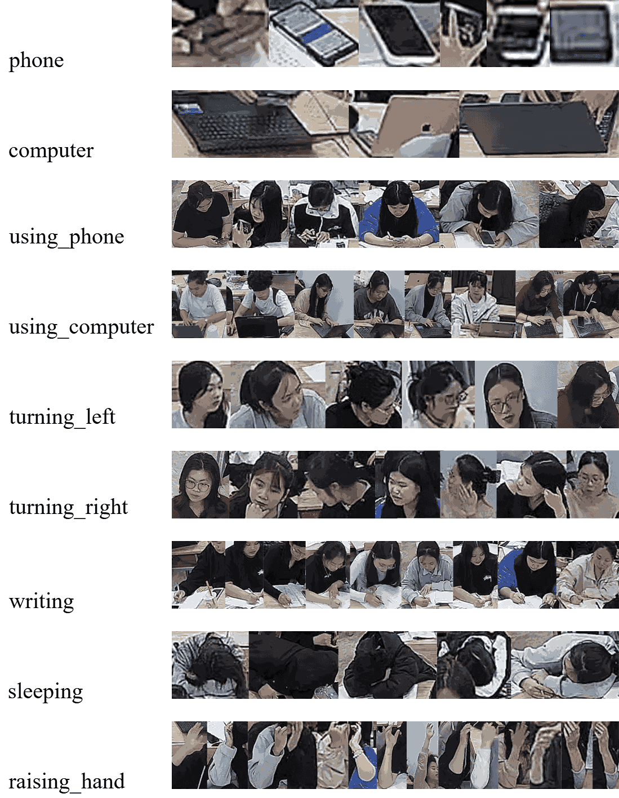

# T-Students FITDNU: Student Behavior Detection (Single-Camera)

> A single–ceiling–camera classroom dataset for student behavior detection, designed for practical, real-time deployment.

**Dataset page:** [Link](https://universe.roboflow.com/tstudentsfitdnu/t-students-fitdnu/dataset/1)

---

## 1) Overview

- **Real classroom, single camera**: collected from a fixed dome camera mounted on the ceiling (1080p @ 25fps) across multiple sessions (morning/afternoon) to capture lighting and layout diversity.  
- **9 classes**: **7 behaviors** (*using_phone, using_computer, sleeping, turning_left, turning_right, raising_hand, writing*) and **2 objects** (*phone, computer*).  
- **Scale**: **3,351 images** and **126,429 bounding boxes**, with many small objects and partial occlusions.  
- **Annotation pipeline**: manual → assisted (detector-aided) → QC + augmentations.  
- **Goal**: enable research and real-time deployments in classrooms using a **single ceiling camera**.

---

## 2) Class Exemplars (drop-in image)

> Replace or keep the following figure to illustrate the 9 classes (2 objects + 7 behaviors).

<p align="center">
  
</p>

---

## 3) Access & Download

**Roboflow Universe (recommended):** open the dataset page (**[Link](https://universe.roboflow.com/tstudentsfitdnu/t-students-fitdnu/dataset/1)**), choose a **Version** and **Export Format** (YOLOv5/YOLOv8/COCO JSON/VOC…), and download via UI or API.

**Python quick start (exact snippet)**
```python
# Install Roboflow
!pip install roboflow

# Download the dataset (YOLOv8 format)
from roboflow import Roboflow
rf = Roboflow(api_key="I3FNHTRuP6LdJ2WMXWqz")
project = rf.workspace("tstudentsfitdnu").project("t-students-fitdnu")
version = project.version(1)
dataset = version.download("yolov8")
```

---

## 4) Labels & Format

### 4.1 Class list
```text
Behavior: using_phone, using_computer, sleeping, turning_left, turning_right, raising_hand, writing
Object:   phone, computer
```

### 4.2 Labeling rules (recommended)
- **Behavior boxes** cover the **interaction region** that best expresses the behavior (e.g., hands + upper body for writing/raising_hand).  
- **Object boxes** tightly fit the physical object (e.g., phone/laptop).  
- Behavior and object boxes may **overlap** and are kept **separate** (do not multi-label a single box).  
- Export to YOLO/COCO/VOC via Roboflow as needed.

---

## 5) Dataset Structure (YOLO example)

```
T-Students-FITDNU/
├─ images/
│  ├─ train/  *.jpg|png
│  ├─ val/    *.jpg|png
│  └─ test/   *.jpg|png
└─ labels/
   ├─ train/  *.txt
   ├─ val/    *.txt
   └─ test/   *.txt
```

> **Splits:** Publish train/val/test counts and the **split policy** (e.g., by session/class/time) to avoid leakage and to mirror deployment conditions.

---

## 6) Fast Training with Ultralytics YOLO

### 6.1 Install
```bash
pip install ultralytics
```

### 6.2 `data.yaml` (example)
```yaml
# data.yaml
path: /path/to/T-Students-FITDNU
train: images/train
val:   images/val
test:  images/test
names:
  - using_phone
  - using_computer
  - sleeping
  - turning_left
  - turning_right
  - raising_hand
  - writing
  - phone
  - computer
```

### 6.3 Commands
```bash
# Train (choose imgsz 640/960/1280 for the mAP–speed trade-off)
yolo detect train data=data.yaml model=yolov8m.pt imgsz=960 epochs=100 batch=16 amp=True

# Evaluate
yolo detect val data=data.yaml model=runs/detect/train/weights/best.pt

# Inference
yolo detect predict model=runs/detect/train/weights/best.pt source=path/to/images
```

### 6.4 Practical tips
- **Class imbalance**: consider class weights, Focal Loss, Repeat Factor Sampling, and controlled copy-paste/mosaic.  
- **Overlaps/NMS**: try Soft-NMS or DIoU-NMS when behavior & object boxes overlap frequently.  
- **Resolution**: experiment with 640/960/1280.  
- **Temporal smoothing (optional)**: lightweight tracking (e.g., BYTETrack) can stabilize brief behaviors like *raising_hand*.

---

## 7) Benchmarks (paper summary)

- Evaluated **YOLOv7**, **YOLOv8l**, **YOLOv12s**, and **Faster R-CNN** on 9 classes.  
- **YOLOv8l** provided the best overall balance of accuracy and robustness, especially for subtle behaviors and small objects.  
- *raising_hand* remains challenging due to rarity, small motion cues, and frequent occlusions.  
- A real-time prototype runs at **~17 FPS** on a common GPU in a multi-threaded pipeline (capture → inference → web UI).

> When releasing checkpoints, include training settings (optimizer, LR schedule, epochs, seed), conf/NMS thresholds, and augmentation details to ensure reproducibility.

---

## 8) Real-Time Deployment (suggested)

- Input: **RTSP** from the ceiling camera → YOLO inference → **Web UI** (MJPEG/WebSocket).  
- Throughput: consider TensorRT/ONNX Runtime, FP16, pinned memory, and multi-threaded I/O.  
- Measure and report **latency breakdown** (capture/infer/encode) and **FPS** per configuration.

---

## 9) License & Ethics

- **License**: e.g., CC BY-NC 4.0 / Academic-Only (update to your official policy).  
- **Privacy**: anonymize (blur) faces in sample images; ensure usage complies with institutional ethics approvals.  
- **Commercial use**: request permission from the maintainers if needed.

---

## 10) Roadmap

- [ ] Publish official **train/val/test** split and session/time-based split policy.  
- [ ] Release **checkpoints** and training/evaluation scripts.  
- [ ] Add **per-class PR curves**, **confusion matrix**, and **FPS/latency** reports.  
- [ ] Explore remedies for rare classes (Focal Loss, re-weighting, copy-paste).

---

## 11) Citation

If you use **T-Students FITDNU**, please cite the paper/dataset (update with your official venue details when available).

```bibtex
@inproceedings{tran2025_tstudents_fitdnu,
  title        = {Systematic Evaluation of YOLO in Student Behavior Detection - A New Dataset},
  author       = {Tran, Anh Tu and Nguyen, Thai Khanh and Nguyen, Trung Thanh and Tuan, Anh Ha and Le, Trung Hieu},
  booktitle    = {ISCIT},
  year         = {2025},
  howpublished = {Dataset on Roboflow Universe (see README dataset page: Link)}
}
```

---

## 12) Contact

- **Maintainer**: Trần Anh Tú  
- **Email**: tu05062005@gmail.com  
- Issues/Discussion: open GitHub Issues for your repo or use the Roboflow Universe page: [Link](https://universe.roboflow.com/tstudentsfitdnu/t-students-fitdnu/dataset/1)
